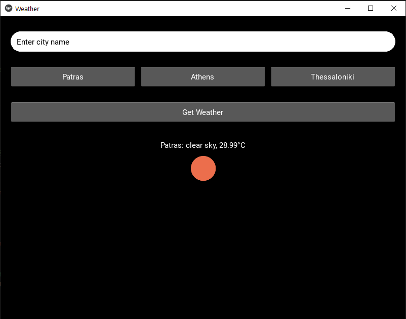

# ☀️ Kivy Weather App

A simple, beautiful weather app built with Python and Kivy using the [OpenWeatherMap API](https://openweathermap.org/api).  
It allows users to check the current weather for any city, and includes quick-access buttons for popular Greek cities.

## 📸 Screenshots

 <!-- Replace or remove if you don't have one -->

## 🚀 Features

- 🔍 Search for weather by city name
- 🏙️ Quick buttons for Athens, Patras, Thessaloniki
- 🌡️ Displays temperature and weather description
- 🎨 Custom styled UI with rounded inputs and responsive layout
- 🔐 Securely loads API key using `.env`

## 🛠 Tech Stack

- Python 3
- Kivy (GUI Framework)
- OpenWeatherMap API
- `python-dotenv` for managing environment variables

## 📦 Installation

1. **Clone the repository**

```bash
git clone https://github.com/your-username/kivy-weather-app.git
cd kivy-weather-app
